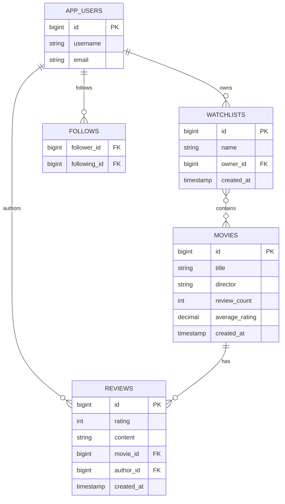

# CinéTrack — Chapter 24 Snapshot

Snapshot of CinéTrack at the end of Chapter 24: *Documentation, ADRs, and Diagrams with AI*.

## What changed in this chapter

No Java source changes. All application code carried forward from Chapter 23.

- **`docs/adr/ADR-001-package-private-services.md`** — architecture decision record for the package-private service class pattern, generated from code using AI and reviewed for accuracy

## Architecture



## Run

```bash
docker compose up -d
mvn spring-boot:run
```

## Run tests

```bash
mvn test
```

## Claude Code workflow

```bash
# Start a development session
claude

# Generate documentation for changed code
# (paste the code into a prompt asking for README or ADR updates)

# Audit conventions before pushing
/check-conventions

# Prepare the PR
/pr-prep
```

## Endpoints

| Method | Path | Description |
|--------|------|-------------|
| POST | `/auth/login` | Get a JWT token |
| GET | `/movies` | List movies (includes reviewCount, averageRating, createdAt) |
| GET | `/movies/{id}` | Get movie by id |
| POST | `/movies` | Create movie |
| PUT | `/movies/{id}` | Update movie |
| DELETE | `/movies/{id}` | Delete movie |
| GET | `/watchlists` | List watchlists (includes createdAt) |
| GET | `/watchlists/{id}` | Get watchlist |
| POST | `/watchlists` | Create watchlist |
| DELETE | `/watchlists/{id}` | Delete watchlist |
| POST | `/watchlists/{id}/movies/{movieId}` | Add movie to watchlist |
| DELETE | `/watchlists/{id}/movies/{movieId}` | Remove movie from watchlist |
| GET | `/reviews` | List reviews (includes createdAt) |
| GET | `/reviews/{id}` | Get review by id |
| GET | `/reviews/movies/{movieId}` | List reviews for a movie |
| GET | `/reviews/users/{userId}` | List reviews by a user |
| POST | `/reviews` | Create review |
| DELETE | `/reviews/{id}` | Delete review |
| GET | `/follows/users/{userId}/following` | List users this user follows |
| GET | `/follows/users/{userId}/followers` | List followers of this user |
| POST | `/follows` | Follow a user |
| DELETE | `/follows/users/{followerId}/following/{followingId}` | Unfollow a user |
